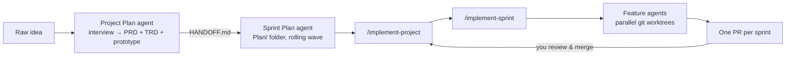

# claude-sprint-pipeline

Turn a raw product idea into reviewed pull requests with [Claude Code](https://claude.com/claude-code) — through a validated PRD/TRD, a rolling-wave sprint plan, and orchestrated multi-agent sprint execution.

**Two agents plan. Three skills execute. You review one PR per sprint.**

| Component | Type | Job |
|---|---|---|
| **Project Plan** | Agent | Interviews you about a raw idea → full-scope PRD, TRD, clickable prototype, and a durable handoff manifest |
| **Sprint Plan** | Agent | Approved PRD/TRD → dependency-ordered sprint plan (~32–44h sprints), fully detailed two sprints ahead, stubs beyond |
| **/implement-project** | Skill | Runs the next due sprint, keeps the plan expanded two ahead, stops at each PR for your review |
| **/implement-sprint** | Skill | Executes one sprint: sprint branch, up to 3 parallel worktree feature agents, serialized merges, plan-conformance review, one PR |
| **/expand-sprints** | Skill | Expands the next two stub sprints into full detail against the *real* codebase (rolling-wave planning) |

## How it flows



The pipeline is deliberately gated: nothing is implemented from an unapproved PRD, no sprint starts before its predecessor's PR is merged to main, and no deferred decision is ever silently guessed — open decisions live in the PRD as `PTD-<n>` entries until *you* resolve them.

## Install

### Option 1 — install script (recommended)

Copies the agents and skills into your personal `~/.claude/` directory:

```bash
git clone https://github.com/fenil1104dave/claude-sprint-pipeline.git
cd claude-sprint-pipeline
./install.sh
```

Restart Claude Code. You should see the **Project Plan** and **Sprint Plan** agents (`/agents`) and the `/implement-project`, `/implement-sprint`, and `/expand-sprints` skills.

### Option 2 — Claude Code plugin

```bash
claude plugin marketplace add fenil1104dave/claude-sprint-pipeline
claude plugin install sprint-pipeline@fenildave
```

Note: as a plugin, skills are namespaced (e.g. `sprint-pipeline:implement-project`). The install script (Option 1) gives you the bare `/implement-project` names that the docs use.

### Recommended: global conventions

The pipeline reads and writes `.claude/PROJECT_STATUS.md` and follows a sprint/feature branch workflow. Add the sections from [`templates/global-conventions.md`](templates/global-conventions.md) to your `~/.claude/CLAUDE.md` so every session honors the same conventions.

## Usage

1. **Bring an idea.** Ask Claude Code to use the Project Plan agent: *"I have an idea: an app that … — plan it."* The agent interviews you (every question comes with its recommendation), flags viability risks, then writes:
   - `docs/planning/<slug>/PRD/` — root + one file per module, with a **Pending To Decide** register
   - `docs/planning/<slug>/TRD/` — mirrored technical coverage
   - `docs/planning/<slug>/prototype/index.html` — clickable prototype
   - `docs/planning/<slug>/HANDOFF.md` — the contract every downstream component reads
2. **Approve.** The satisfaction gate shows you exactly where everything is. On approval the PRD/TRD get a `Status: Approved` marker — nothing downstream runs without it.
3. **Sprint plan.** The Sprint Plan agent (invoked from the handoff, or directly) writes `Plan/` — `Overview.md` (sprint table, dependency graph, milestones), per-sprint folders, one feature file per feature with acceptance criteria, verification steps, branch names, and dependencies.
4. **Execute.** Run `/implement-project`. It executes the next sprint via `/implement-sprint`: sprint branch off main, feature agents in parallel worktrees, serialized merges (test suite green after every merge), a review of the sprint diff against the plan, then **one PR — and it stops**.
5. **Review, merge, repeat.** Merge the PR, run `/implement-project` again. Stub sprints are expanded against the real codebase as you go (`/expand-sprints` does this on demand).

## File contracts

| File | Written by | Read by |
|---|---|---|
| `docs/planning/<slug>/HANDOFF.md` | Project Plan | Sprint Plan, implement-sprint, expand-sprints |
| `PRD/PRD.md` (`Status:` marker, `PTD-<n>` register) | Project Plan | everything downstream |
| `Plan/Overview.md` | Sprint Plan | implement-project, implement-sprint, expand-sprints |
| `Plan/estimates.md` | Sprint Plan | Sprint Plan (resume/expand) |
| `Plan/Sprint-<n>/EXECUTION.md` | implement-sprint (single writer) | implement-project, expand-sprints |
| `.claude/PROJECT_STATUS.md` | all planners/orchestrators (never feature agents) | every session |

## Design notes

This pipeline was hardened through a multi-perspective design review (systems architecture, agent design, delivery process, red team). The main defenses that came out of it:

- **Durable contracts, not prompt strings** — the handoff between agents is a file on disk (`HANDOFF.md`), so it survives context compaction and standalone invocation.
- **Approval markers** — downstream components verify `Status: Approved` instead of trusting that a document on disk was ever accepted.
- **Rolling wave** — detail is written two sprints ahead and expanded against the code that actually exists, so agents never implement a spec written before any code existed.
- **Re-run safety** — existing plans enter update mode; completed sprints are never renumbered or rewritten; execution resumes from the `EXECUTION.md` ledger.
- **Human pace-setting** — the sprint boundary is one reviewable PR, and the orchestrator will not start sprint N+1 until sprint N is merged.
- **No silent decisions** — deferred choices (`PTD-<n>`) and unvalidated integrations block the sprints that depend on them until resolved by the user, and resolutions are written back into the PRD.

## Requirements

- [Claude Code](https://claude.com/claude-code) CLI, desktop, or IDE extension
- `git`, and `gh` (GitHub CLI) authenticated — used at execution time for branches and PRs

## License

[MIT](LICENSE)
